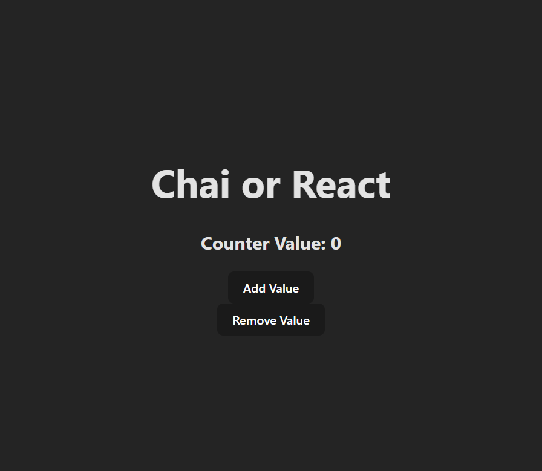
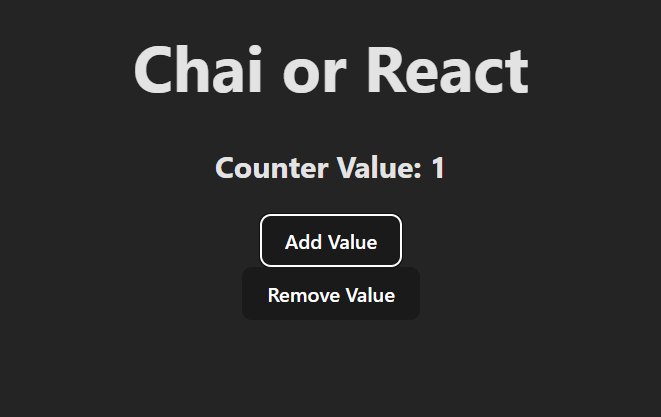
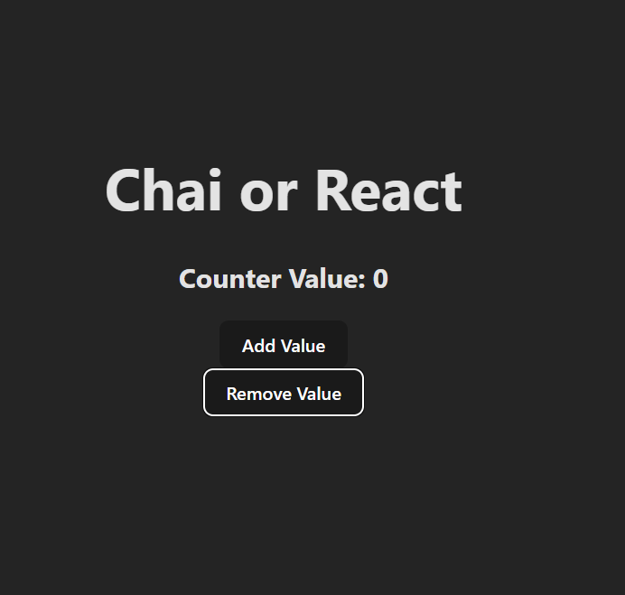

# Chai or React - Counter App

Welcome to the **Chai or React** counter app built with React! This simple app allows users to increase or decrease a counter value. It demonstrates basic state management in React using the `useState` hook.

## Features
- Increment the counter value.
- Decrement the counter value.
- Counter value is capped at a maximum of 20.
- Counter value cannot go below 0.

---

## Screenshots

### 1. Initial State
This is how the app looks when it is first loaded. The counter starts at 0.



### 2. After Clicking Add Value
Once you click the "Add Value" button, the counter increases. Here, the counter is shown at 1.



### 3. After Clicking Remove Value
When you click the "Remove Value" button, the counter decreases. In this screenshot, the counter is at 0.



---

## Installation

To run this project locally, follow these steps:

1. **Clone the repository:**

   ```bash
   git clone https://github.com/Rudraksh121a/React-Counter.git
  
